# The Watcher

*App for watching your shopping expenses made in React.*

## Application Designs

### ShoppingExpenses

#### *Application View*

View of the whole single page application.

### UserAgeModal

#### *Error Modal View*

View of the error modal.

#### *Error Modal View*

View of the whole single page application.

### LoginLogout

#### *Login View*

View of the login page. Testing useContext, useReducer and useEffect.

#### *Application View*

View of the application page.

### MoviesHttp

#### *Application View*

View of the application page.

### TasksCustomHooks

#### *Application View*

View of the application page.

### FormsValidation

#### *Application View*

View of the application page.

### AuthRedux

#### *Login View*

View of the login page.

#### *Application View*

View of the application page.

### ReduxCart

#### *Application View*
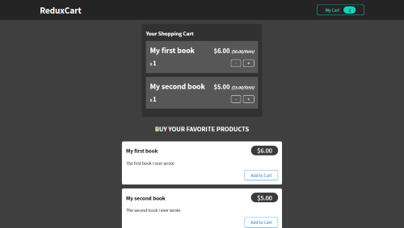

View of the application page.

### QuoteRouting

#### *All Quotes View*
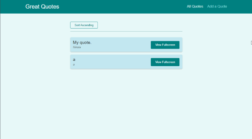

View of all the quotes.

#### *New Quote View*
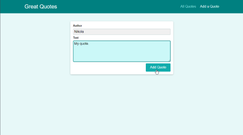

View of the new quote form.

#### *Single Quote View*
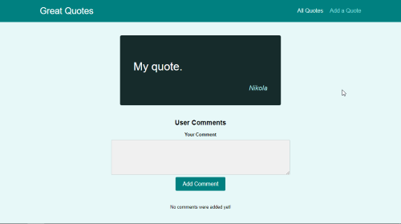

View of the single quote with comments.

### AuthenticationREST

#### *Login View*
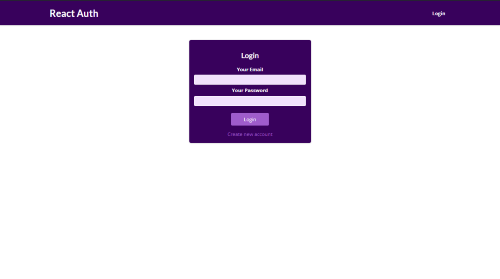

View of the login page.

#### *SignUp View*
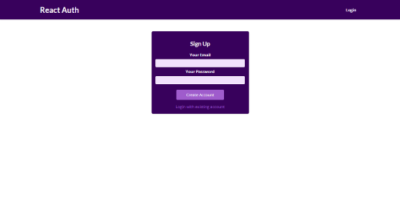

View of the sign up page.

#### *Change Password View*
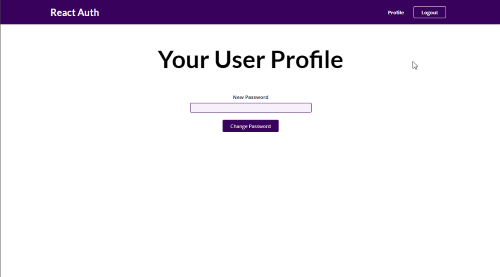

View of the change password page.

### MeetupsNextJS

#### *Home View*
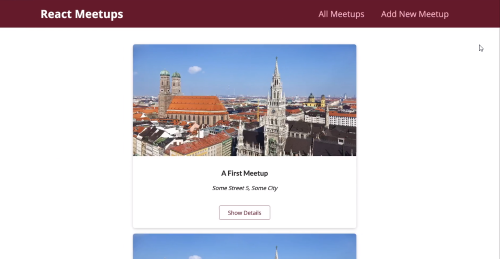

View of the home page.

#### *Single Meetup View*
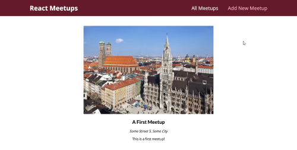

View of the single meetup.

#### *Add A Meetup View*
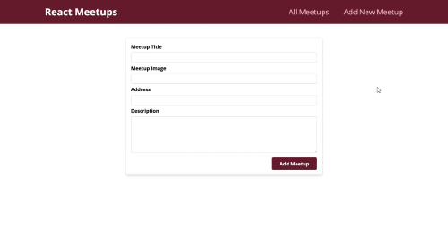

View of the add a meetup form.

### AnimationsReact

#### *Application View*
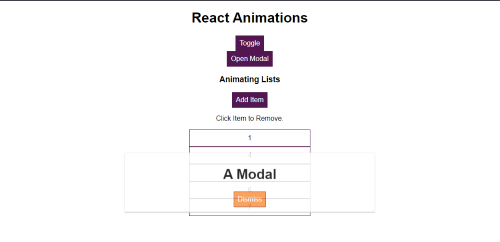

View of the application page.

### TestingReact

#### *Test View*
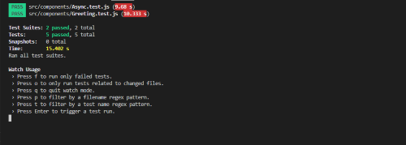

View of the test console.

### TodoReactTS

#### *Todos View*
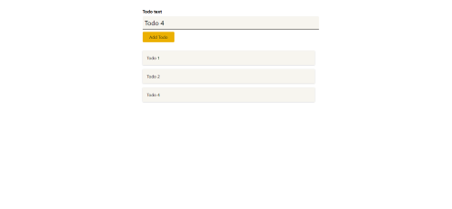

View of all the todos and a form to add new ones.