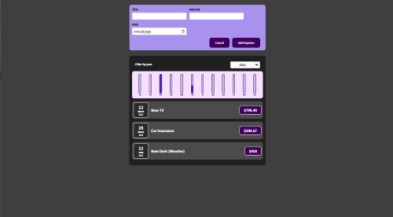
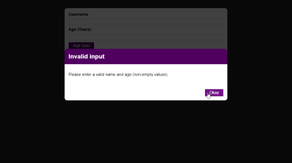
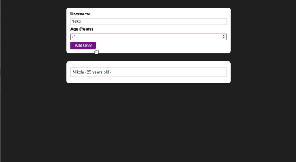
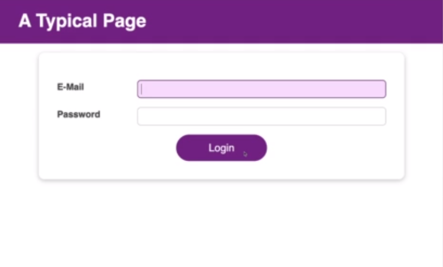
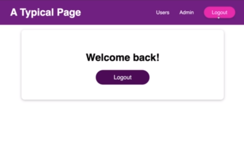
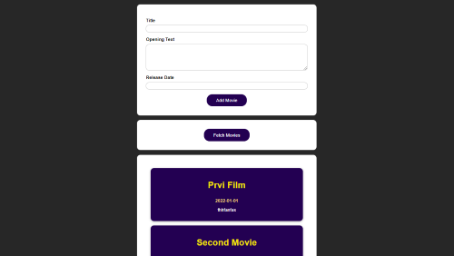
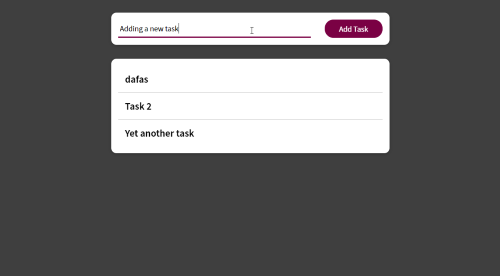
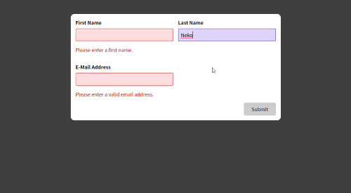
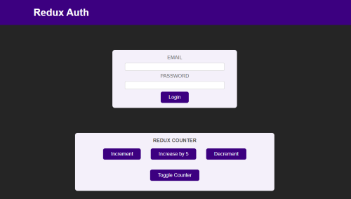
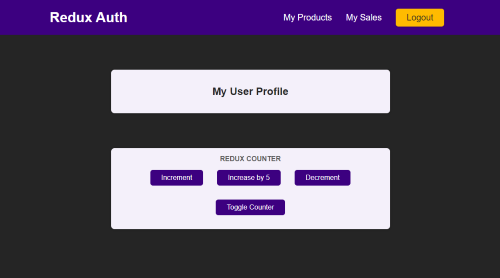

# The Watcher

*App for watching your shopping expenses made in React.*

## Application Designs

### ShoppingExpenses

#### *Application View*

View of the whole single page application.

### UserAgeModal

#### *Error Modal View*

View of the error modal.

#### *Error Modal View*

View of the whole single page application.

### LoginLogout

#### *Login View*

View of the login page. Testing useContext, useReducer and useEffect.

#### *Application View*

View of the application page.

### MoviesHttp

#### *Application View*

View of the application page.

### TasksCustomHooks

#### *Application View*

View of the application page.

### FormsValidation

#### *Application View*

View of the application page.

### AuthRedux

#### *Login View*

View of the login page.

#### *Application View*

View of the application page.